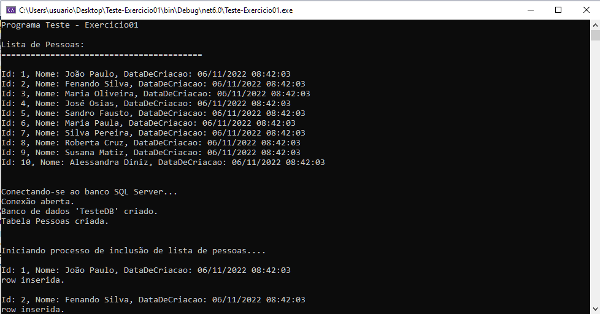
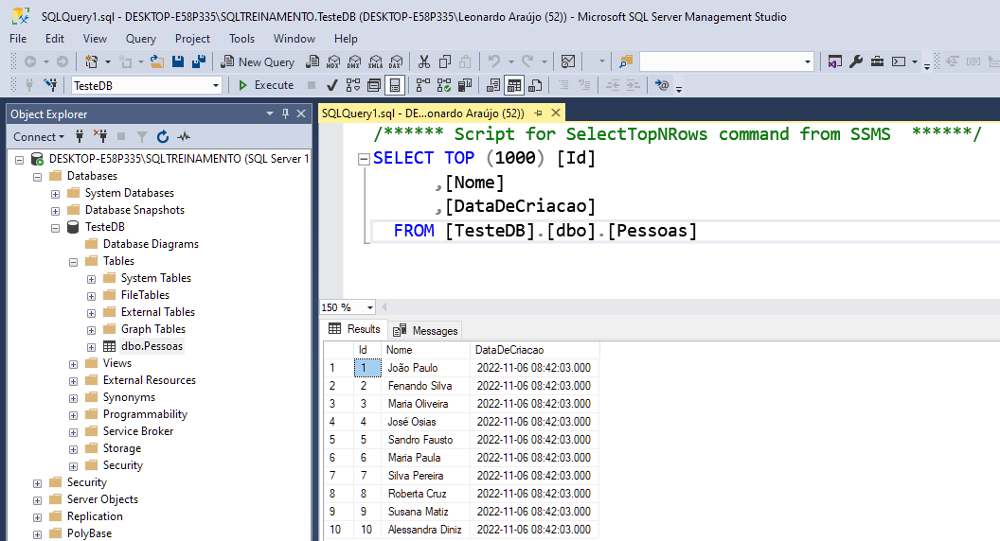

# Projeto: Aplication Console

  <a href="#sobre">Sobre o Projeto ℹ️</a>&nbsp;&nbsp;&nbsp;
  
  <a href="#tecno">Tecnologias 🚀</a>&nbsp;&nbsp;&nbsp;
  <a href="#instrucoes">Instruções / Tutorial 🎓</a>&nbsp;&nbsp;&nbsp;
  <a href="#referencias">Referências 🔗</a>  

 

### Sobre ℹ️

Aplicação Console que insere uma lista de dados no banco de dados SQL Server.

#### Programa
 

#### Banco de dados

[Voltar ⬆️](#indice)

 

### Tecnologias 🚀

- App Console
- .NET 6
- SQL
- SQL Server

[Voltar ⬆️](#indice)

 

### Instruções / Tutorial 🎓

#### Dependências 

- .NET 6 

#### Como Clonar

* Faça **fork** do projeto

* Escolha a url para clone e copie

* Em seu terminal, execute o comando complentando a url clone

      git clone urlExemplo

### Como Usar

***Informações técnicas:***

- Classe Pessoa:

    - Id - INTEGER

    - Nome - VARCHAR

    - Data de criação - DateTime

- Listagem estática contendo 10 nomes de pessoas. 

#### Executar

- Em seu terminal, abra na pasta raiz e execute: 

	    Dotnet run

>**NOTA:** A execução pode ser feita com auxílio de uma IDE

[Voltar ⬆️](#indice)

 

### Referências 🔗

[Voltar ⬆️](#indice)
